# A Survey of Efficient Attention Methods

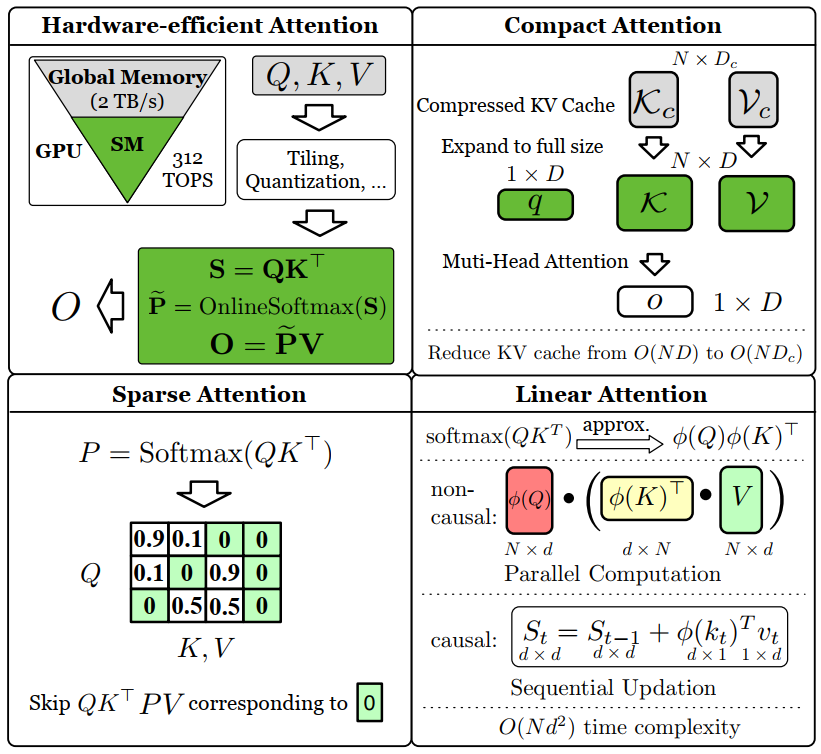

The vanilla attention in Transformers has a quadratic complexity, $O(N^2)$, with respect to sequence length $N$. This creates a significant computational and memory bottleneck for long sequences. This survey provides a comprehensive overview of **Efficient Attention Methods** designed to tackle this challenge, categorizing them into four main families.


<!-- -----

## 👥 About the Team

*(Your team information here)* -->

-----

## 📅 Updates

  - **[2025/8/20]** 🎉 Our survey paper is now publicly available on GitHub\!

-----

## ⚡ Efficient Attention Methods

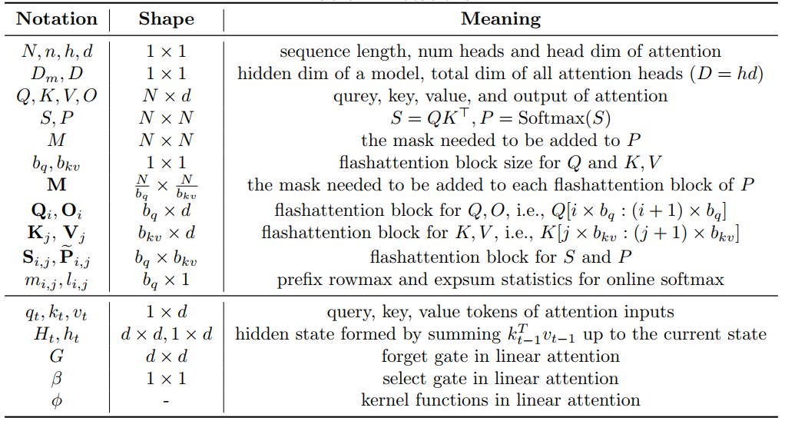

This table summarizes some basic notations used throughout the survey.

### ⚙️ Hardware-Efficient Methods

💡 **Core Idea**: Speed up attention by tailoring computations to specific hardware features, primarily by optimizing memory access patterns.

A prominent example is **FlashAttention**, which reorders the computation to minimize costly memory I/O between the GPU's high-bandwidth memory (HBM) and on-chip SRAM. The diagram below illustrates its core mechanism. 👇

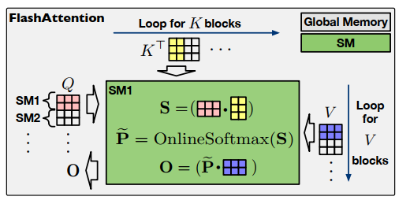

📝 The table below highlights key hardware-efficient methods. 👇

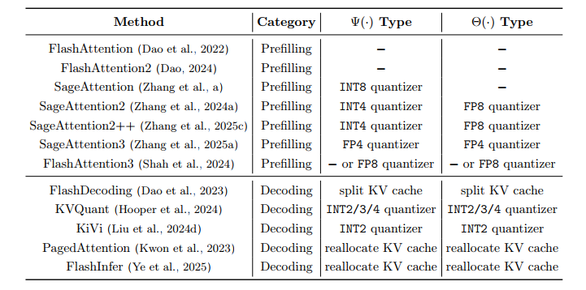

-----

### ✨ Sparse Attention

💡 **Core Idea**: Reduce the computational load by strategically skipping some attention calculations, focusing only on a sparse subset of key-value pairs.

📝 Sparse Attention methods can be divided into two main categories: **Pattern-Based** (fixed sparsity) and **Dynamic** (input-dependent sparsity). The table below compares various approaches. 👇

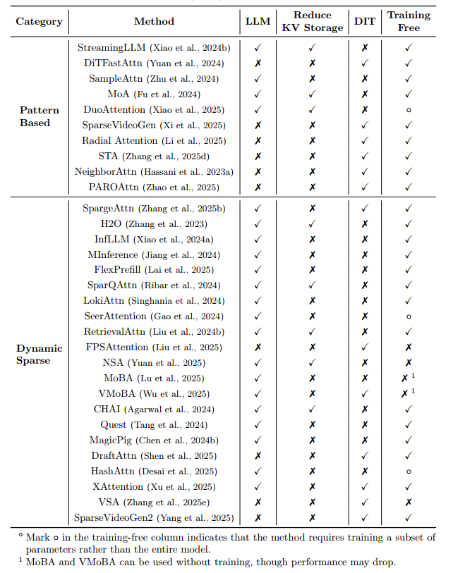

-----

### 🗜️ Compact Attention Methods

💡 **Core Idea**: Reduce memory overhead by compressing the Key-Value (KV) cache using techniques like weight sharing, pruning, or low-rank decomposition.

📝 Below is a comparison of various approaches in compact attention. 👇

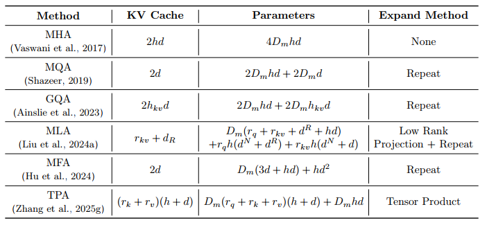

-----

### 🚀 Linear Attention Methods

💡 **Core Idea**: Modify the computational logic of attention to reduce its complexity from quadratic, $O(N^2)$, to linear, $O(N)$.

Linear Attention is a diverse category with several key design variations.

#### Computational Forms

Linear Attention can be implemented in three primary forms: **parallel**, **recurrent**, and **chunkwise**, each offering different trade-offs for training and inference.

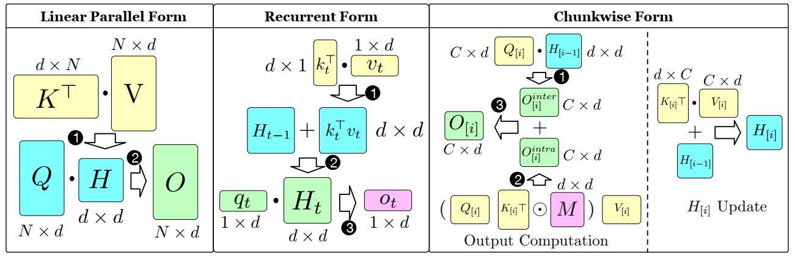

#### Gating Mechanisms

To enhance their expressive power, many linear attention variants incorporate gating mechanisms, such as **forget gates** and **select gates**.

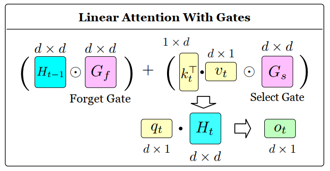

Based on the presence of these gates, we can classify linear attention methods as follows:

1.  **Naive Linear Attention (No Gates)**

    📝 The table below highlights key methods in this category. 👇

    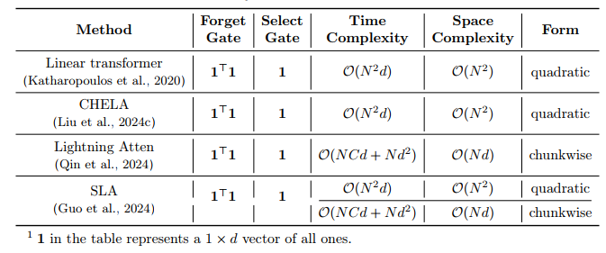

2.  **Linear Attention with a Forget Gate**

    📝 This table compares notable methods that use a forget gate to manage state information. 👇

    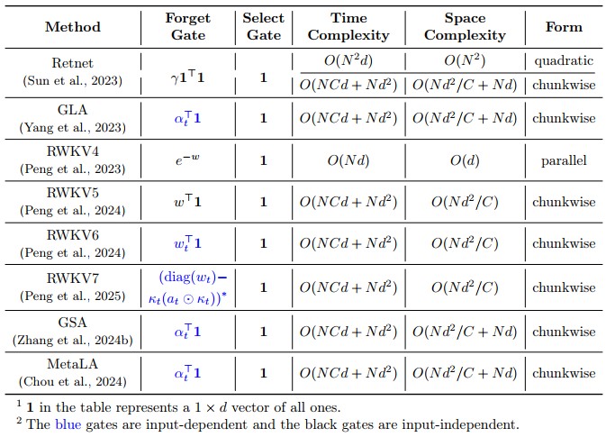

3.  **Linear Attention with Forget and Select Gates**

    📝 This table compares methods that utilize both gate types for more sophisticated state control. 👇

    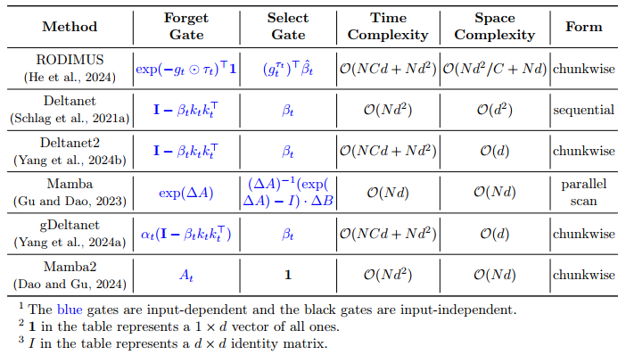

#### A Special Case: Test-Time Training (TTT)

A unique approach, **Test-Time Training (TTT)**, treats the hidden states of linear attention as learnable parameters that are optimized during the inference phase.

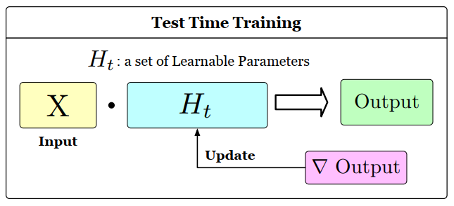

-----

## 📜 Citation

If you find our work helpful, please consider citing our paper:

```
@article{zhang2025efficient,
  title={Efficient Attention Methods: A Comprehensive Survey},
  author={Jintao Zhang and Rundong Su and Chunyu Liu and Jia Wei and Ziteng Wang and Pengle Zhang and Haoxu Wang and Huiqiang Jiang and Haofeng Huang and Chendong Xiang and Haocheng Xi and Shuo Yang and Xingyang Li and Yuezhou Hu and Tianyu Fu and Tianchen Zhao and Yicheng Zhang and Youhe Jiang and Chang Chen and Kai Jiang and Huayu Chen and Min Zhao and Xiaoming Xu and Jun Zhu and Jianfei Chen},
  year={2025}
}
```