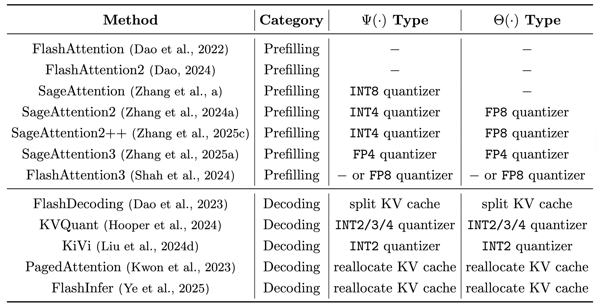
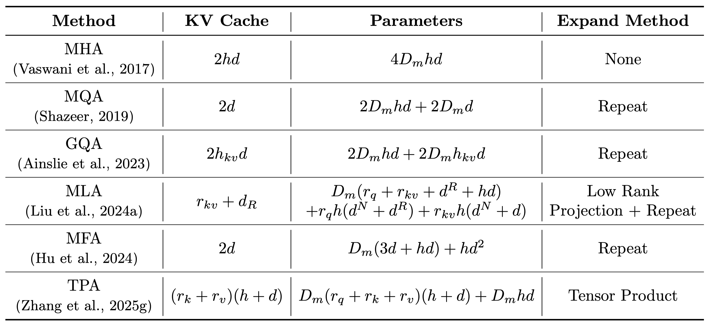
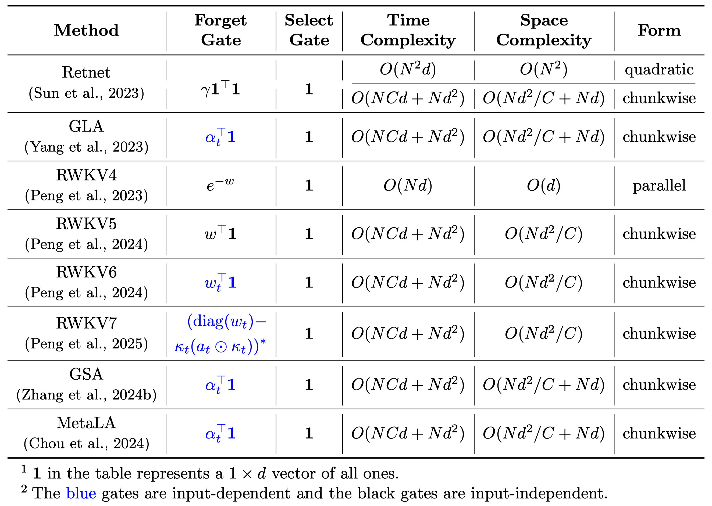

# Efficient Attention Methods: A Comprehensive Survey

Efficient Attention Methods: A Comprehensive Survey  
Paper Link: https://github.com/attention-survey/Efficient_Attention_Survey/blob/main/resource/Attention_Survey.pdf


This survey provides a comprehensive overview of **Efficient Attention Methods**, categorizing them into four main classes.

-----

## Updates

 - **[2025/8/20]** 🎉 Our survey paper is now publicly available on [GitHub](./resources/paper.pdf)! If you do find our resources helpful, please [cite our paper](#citation).


-----

## Class 1: Hardware-Efficient Attention

💡 **Core Idea**: Accelerate attention by leveraging
hardware characteristics.

📝 **Overall Formulations**: 

Hardware-Efficient Attention of the prefilling stage can be formulated as:
 

Hardware-Efficient Attention of the decoding stage can be formulated as:
 

 ---

An example is **FlashAttention**, which tiles $Q, K, V$ to progressively compute the attention output $O$. Such a strategy avoids the I/O of $S, P$ matrices in the shape of $N \times N$.

 

---

The table below summarizes various hardware-efficient attention methods. 👇




-----

## Class2: Compact Attention

💡 **Core Idea**: Compressing the KV cache
of attention by weight sharing or low rank decomposition while keeping computational
cost unchanged, as with a full-sized KV cache. 

📝 **Overall Formulations**: 

 

---

 Below is a comparison of various approaches in compact attention. 👇




-----

## Class3: Sparse Attention

💡 **Core Idea**: Selectively performing certain computations in attention while omitting others.

📝 **Overall Formulations**: 

 

 ---

The table below summarizes various sparse attention methods. 👇


-----

## Class4: Linear Attention

💡 **Core Idea**: Modifying the
computational logic of attention to reduce its complexity to $O(N)$. 

📝 **Overall Formulations**: 

 

---
### Computational Forms

Linear Attention can be implemented in three primary forms: **parallel**, **recurrent**, and **chunkwise**.


---

### Gating Mechanisms

Many linear attention methods incorporate **forget gates** and **select gates**.

 

Based on the presence of these gates, we can classify linear attention methods as follows:

1.  **Naive Linear Attention (No Gates)**

    📝 The table below summarizes naive attention methods. 👇

    


2.  **Linear Attention with a Forget Gate**

    📝 This table compares methods that use a forget gate. 👇

    


3.  **Linear Attention with Forget and Select Gates**

    📝 This table compares methods that utilize both forget gate and select gate. 👇

    
    

### A Special Case: Test-Time Training (TTT)

A unique approach, **Test-Time Training (TTT)**, treats the hidden states of linear attention as learnable parameters.

 

-----

## Citation

If you find our work helpful, please consider citing our paper:

```
@article{zhang2025efficient,
  title={Efficient Attention Methods: A Comprehensive Survey},
  author={Zhang, Jintao and Su, Rundong and Liu, Chunyu and Wei, Jia and Wang, Ziteng and Zhang, Pengle and Wang, Haoxu and Jiang, Huiqiang and Huang, Haofeng and Xiang, Chendong and Xi, Haocheng and Yang, Shuo and Li, Xingyang and Hu, Yuezhou and Fu, Tianyu and Zhao, Tianchen and Zhang, Yicheng and Jiang, Youhe and Chen, Chang and Jiang, Kai and Chen, Huayu and Zhao, Min and Xu, Xiaoming and Zhu, Jun and Chen, Jianfei},
  year={2025}
}
```