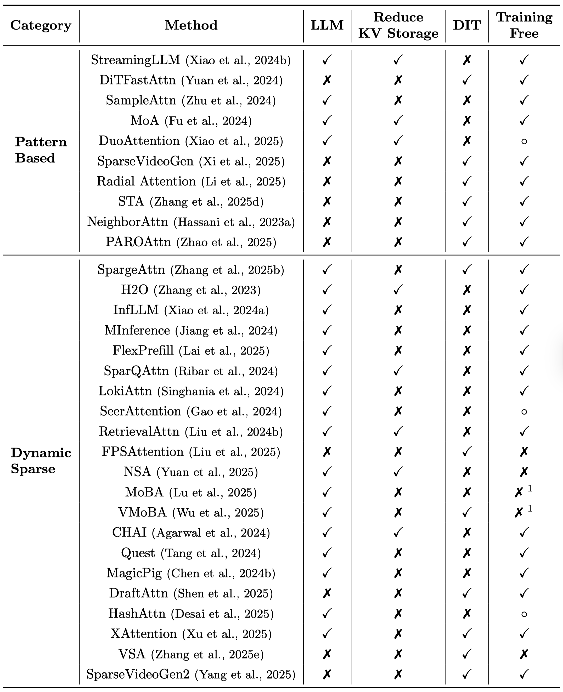
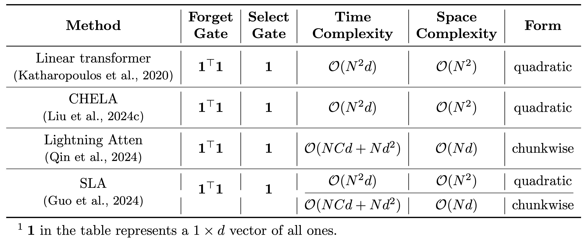

# A Survey of Efficient Attention Methods

**A Survey of Efficient Attention Methods: Hardware-efficient, Sparse, Compact, and Linear Attention**  
**PDF**: https://attention-survey.github.io/files/Attention_Survey.pdf  
Paper webpage: https://attention-survey.github.io


This paper provides a comprehensive survey of **Efficient Attention Methods**, categorizing them into four classes.

-----

## Updates

 - **[2025/8/19]** 🎉 Our survey paper is now publicly available on [GitHub](https://attention-survey.github.io/files/Attention_Survey.pdf)! If you do find our resources helpful, please [cite our paper](#citation).

-----

## Class 1: Hardware-Efficient Attention

💡 **Core Idea**: Accelerate attention by leveraging hardware characteristics.

📝 **Overall Formulations**: 

Hardware-Efficient Attention for the prefilling stage can be formulated as:
 

Hardware-Efficient Attention for the decoding stage can be formulated as:
 

 ---

An example is **FlashAttention**, which tiles $Q, K, V$ to progressively compute the attention output $O$. Such a strategy avoids the I/O of $S, P$ matrices in the shape of $N \times N$.

 

---

The table below summarizes various hardware-efficient attention methods. 👇


-----

## Class2: Compact Attention

💡 **Core Idea**: Compressing the KV cache of attention by weight sharing or low rank decomposition while keeping computational cost unchanged, as with a full-sized KV cache. 

📝 **Overall Formulations**: 

 

---

 Below is a summarization of various approaches in compact attention. 👇


-----

## Class3: Sparse Attention

💡 **Core Idea**: Selectively performing a subset of computations in attention while omitting others.

📝 **Overall Formulations**: 

 

 ---

The table below summarizes various sparse attention methods. 👇



-----

## Class4: Linear Attention

💡 **Core Idea**: Redesigning the computational formulation of attention to achieve \(\mathcal{O}(N)\) time complexity. 

📝 **Overall Formulations**: 

 

---
### Computational Forms

Linear Attention can be implemented in three forms: **parallel**, **recurrent**, and **chunkwise**.


---

### Gating Mechanisms

Many linear attention methods incorporate **forget gates** and **select gates**.

 

Based on the presence of these gates, we can classify linear attention methods as follows:

1.  **Naive Linear Attention (No Gates)**

    📝 The table below summarizes naive attention methods. 👇

    


2.  **Linear Attention with a Forget Gate**

    📝 This table compares methods that use a forget gate. 👇

    


3.  **Linear Attention with Forget and Select Gates**

    📝 This table compares methods that utilize both the forget gate and the select gate. 👇

    
    

### A Special Case: Test-Time Training (TTT)

A unique approach, **Test-Time Training (TTT)**, treats the hidden states of linear attention as learnable parameters.

 

-----

## Citation

If you find our work helpful, please cite our paper:

```
@article{zhang2025efficient,
  title={Efficient Attention Methods: A Comprehensive Survey},
  author={Zhang, Jintao and Su, Rundong and Liu, Chunyu and Wei, Jia and Wang, Ziteng and Zhang, Pengle and Wang, Haoxu and Jiang, Huiqiang and Huang, Haofeng and Xiang, Chendong and Xi, Haocheng and Yang, Shuo and Li, Xingyang and Hu, Yuezhou and Fu, Tianyu and Zhao, Tianchen and Zhang, Yicheng and Jiang, Youhe and Chen, Chang and Jiang, Kai and Chen, Huayu and Zhao, Min and Xu, Xiaoming and Zhu, Jun and Chen, Jianfei},
  year={2025}
}
```
